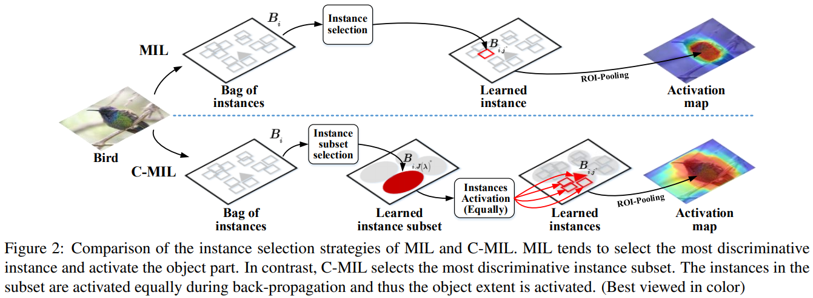

# \(2019\) C-MIL

* 논문링크: [https://arxiv.org/pdf/1904.05647v1.pdf](https://arxiv.org/pdf/1904.05647v1.pdf)
* 코드링크: [https://github.com/Winfrand/C-MIL](https://github.com/Winfrand/C-MIL)

* Weakly supervised object detection \(WSOD\) 

Introduction

* 딥러닝 결합한 WSOD에서는,  학습 초기에 전체 object 가 아니라, 일부분만 활성화 한다는 문제점이 있다\(Fig. 1\(a\)\)
* 이런 현상은 loss 함수의 non-convexity 때문에 발생한다.
* 이런 함수를 최적화 할때는  local minima에 빠지기 쉽다\(i.e. 전체 객체 범위를 무시하면서, 이미지 분류를 위해 가장 식별 가능한 영역\(인스턴스\)를 선택\)
* 연구자들은 이러한 문제를 spatial regularization, context information, progressive refinement 등의 방법을 사용하여 완화시켜왔지만, 최적화 관점에서 해결되지 않고 있다. 

* 본 눈문에서, 우리는 연속적인 방법을 소개한다.
* .....
* The contributions of this paper include: 
  * \(1\) A novel C-MIL approach which uses a series of smoothed loss functions to approximate the original loss function, alleviating the non-convexity problem in multiple instance learning. 
  * \(2\) A parametric strategy for instance subset partition, which is combined with a deep neural network to activate full object extent. 
  * \(3\) New state-of-the-art performance of weakly supervised detection and localization on commonly used object detection benchmarks

Related Work

2.1. Weakly Supervised Methods

2.2. Non-convex optimization

Methodology

* C-MIL은 이미지를 bags로 object proposal method로 부터 generated된  이미지의 영역을 instance로 다룬다.
* 목적은 인스턴스 분류기\(detector\)를 학습하는 것이다.

* Fig 2의 notation

3.1. MIL Revisit

* MIL method는 2단계로 나뉘어 질 수 있다.
* **\(1\)instance selection** 
  * instance selector는 각 인스턴스의 object 점수를 계산하여, positive 인스턴스를 필터링 한다.
  * wf는 instance selector의 파라미터를 의미하며,
  * j\*는 Bag\(이미지\)에서 제일 높은 점수로 선택된 인스턴스의 인덱스를 의미한다.

* \(2\) detector estimation
  * wg는 detector의 파라미터를 의미한다.
  * 

3.2. Convexity Analysis

* 1\) How to optimize the non-convex function
* 2\) How to perform instance selection in the early training stages when the instance selector is not well trained.

3.3. Continuation MIL

* 람다를 변화시켜 가면서, 처음에 넓은 범위를 보고 점점 좁은 범위를 보는듯.
* 

